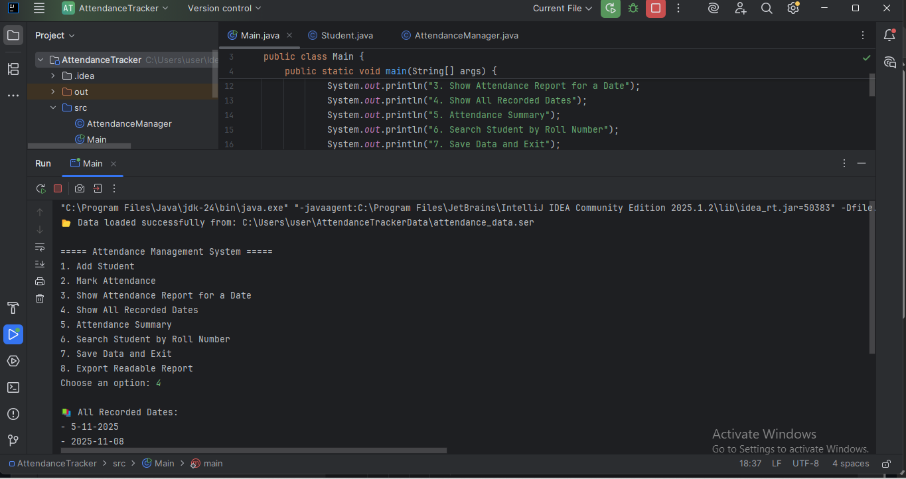

# Attendance Management System (Java Console Application)

## 📘 Overview
This project is a **console-based Attendance Management System** built using Java.  
It allows users to add students, mark daily attendance, view attendance reports, search for individual student attendance, and generate a **readable text report**.  

The system uses:
- Java OOP (classes & objects)
- Collections (List, Map)
- File Handling & Serialization
- Persistent storage (data remains even after closing the program)
- Report generation using FileWriter & PrintWriter

---

## 📸 Sample Output (Screenshot)

## 🧩 Features
- Add new students  
- Mark attendance for any date  
- View attendance report for a specific date  
- View all dates on which attendance was taken  
- Attendance summary (Present/Absent count per student)  
- Search attendance using roll number  
- Automatically saves data permanently  
- Export attendance report in readable text format (`attendance_report.txt`)

---

## 🗂 Simple Project Structure
Main.java
AttendanceManager.java
Student.java
AttendanceTrackerData/ (folder automatically created)
- attendance_data.ser (saved data)
- attendance_report.txt (exported readable report)

---

## ▶️ How to Run

### Step 1 — Compile the Java files:
`bash`
`javac Main.java AttendanceManager.java Student.java`

Step 2 — Run the program:
java Main

🖥️ Menu Options
1. Add Student
2. Mark Attendance
3. Show Attendance Report for a Date
4. Show All Recorded Dates
5. Attendance Summary
6. Search Student by Roll Number
7. Save Data and Exit
8. Export Readable Report

🧾 Example Readable Report (attendance_report.txt)
Date, Roll Number, Name, Status
2025-11-05, 101, Pavithra, Present
2025-11-05, 102, Jahnavi, Absent
2025-11-06, 101, Pavithra, Present
2025-11-06, 102, Jahnavi, Present

🧠 Concepts Learned
Object-Oriented Programming
Serialization & Deserialization
File Handling (saving/loading data)
Working with Java Collections
Creating reports
Designing a console menu-based application

🔮 Future Improvements
Connect to MySQL using JDBC
Add a GUI (JavaFX/Swing)
Add login system
Calculate attendance percentages
Export report in CSV/Excel format

👩‍💻 Developer
Kandi Naga Pavithra
Electronics and Communication Engineering
