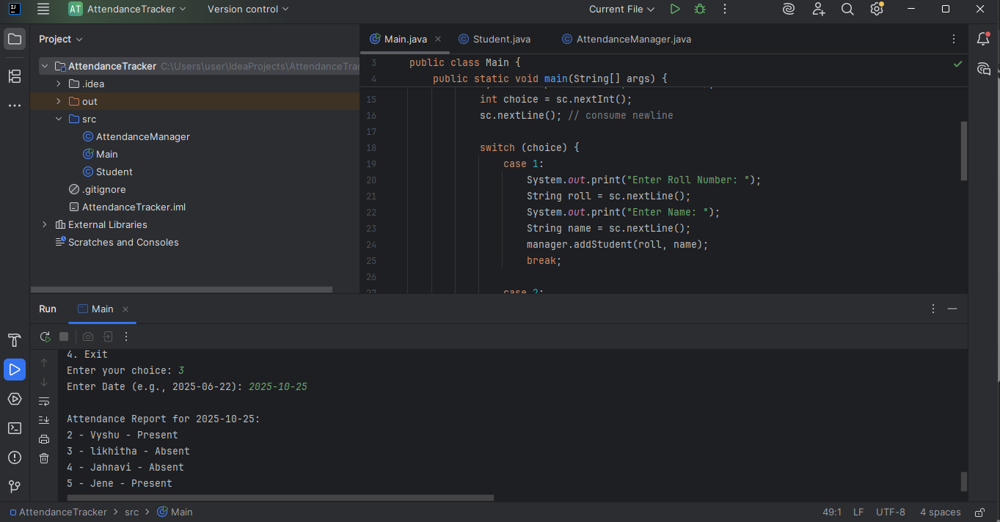

# Attendance Manager

A simple Java project to manage and track student attendance. This project allows marking attendance for each student individually and stores the records in a file.

---

## Project Files

- `AttendanceManager.java` – Main class for managing attendance.  
- `Main.java` – Entry point to run the project.  
- `Student.java` – Class representing student details.  
- `README.md` – Project documentation (this file).  
- `scofattendancetracker.png` – Screenshot of the project interface.

---

## Features

- Mark attendance for each student (`Present` or `Absent`).  
- Saves attendance records with the date and time in a text file.  
- Simple and easy-to-use interface for managing student attendance.  

---

## Screenshot



---

## How to Run

1. Make sure you have **Java installed** on your system.  
2. Open terminal or command prompt in the project folder.  
3. Compile the Java files:

```bash
javac Main.java AttendanceManager.java Student.java
